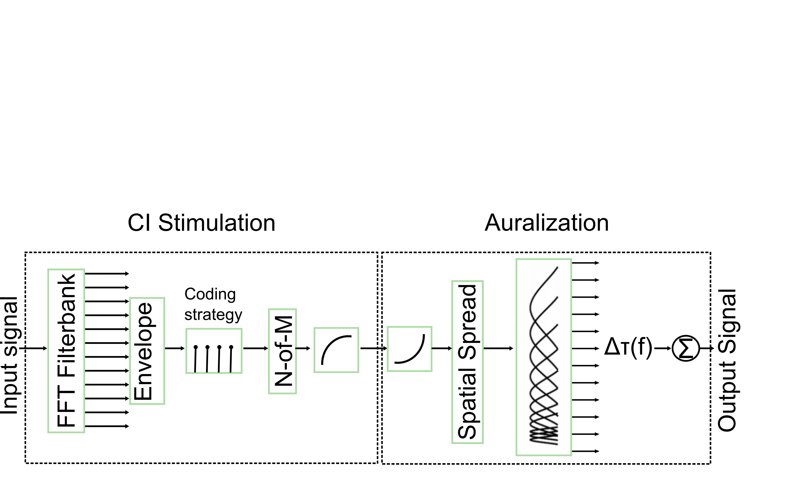

# Pulsatile Vocoder #
[](https://doi.org/10.5281/zenodo.3233518)
### What is the Pulsatile Vocoder? ###

The pulsatile Vocoder ist a tool for conducting Cochlear Implant (CI) listening experiments with normal hearing subjects. It mimics the signal processing stages in a cochlear implant, the electrode placement in the cochlea, and the spatial spread of excitation due to electrical stimulation, and makes the signal audible again.
More specifically it simulates the ACE CI-coding strategy (Nogueira et al, 2005) or the CIS CI-coding strategy
and then the place of stimulation of either the Cochlear Contour Advance Electrode Array or the MedEl Flex 24 electrode according
to place-to-frequency-data from Landsberger et al., 2015.
The basic idea is first an CI stimulation stage, followed by an auralization stage (Bräcker et al., 2009).The signal is processed like in a CI and the output of the CI stimulation stage is an electrodogramm,
which then can be send to a CI subjects implant. In the next step, this electrodogram is auralized, to make it audible for normal hearing subjects.
This version is able to produce electrodogramms, which has been sucessfully tested in actual CI subjects (Hu et al, 2018, Eichenauer et al, 2016).



### CI coding strategy ###

Currently the following coding strategies are supported:

* ACE coding strategy as described in Nogueira et al, 2005, sucessfully tested on CI subjects (Eichenauer et al, 2016)
* CIS coding strategy as described in Wilson, 1991, sucessfully tested on CI subjects (Hu et al, 2018, Williges et al, 2018)

Please note that this coding strategy is a proof-of-concept coding strategy.
There is no guarantee, that they work exactly as the coding strategies available
in CI research interfaces or in CI speech processors.

### How do I get started? ###

* Download the zip-File or clone the git repo locally.
* Open Matlab and cd to the downloaded directory

The most important file is `CI_Sim.m`.
This function does the complete simulation of CI signal processing and auralization. It returns an audible signal again, which you can listen to.
Below is one code example:

```
#!matlab
addpath('Vocoder');
addpath('CI_CODING_STRAT');
[signal,fs] = audioread(['Vocoder' filesep 'OLSA.wav']);

% ACE coding strategy (used in Cochlear)
vocoded_signal = CI_Sim(signal(:,1),fs,'Cochlear');
sound(vocoded_signal,fs);
% CIS coding strategy (used in Med-El)
voc_signal = CI_Sim(signal(:,1),fs,'Med-El');
sound(voc_signal,fs)
```

Due to the use of Gammatonefilterbanks in the Auralisation stage, the vocoded signal will have a small delay corresponding to the group delay of the lowest filter.
Currently, this vocoder-release only supports one channel. 

### Adjustable CI parameters ###

The CI parameters are split into two parameter files, one for the CI simulation (CI_CODING_STRAT/ACEParameters.m) and one for the CI auralization (Vocoder/CI_Params.m). Below is a short list of some adjustable parameters:
 * Analysis frequency channels (default: 186-8000Hz)
 * M and T-levels
 * Number of electrodes (default 22 for ACE, 12 for CIS)
 * Number of active electrodes (n-of-m, default 8 out of 22)
 * pps per channel (default: 900 pps)
 * Electrode-to-place mapping (auralistion only)
 * Simulation of spatial spread (auralisation only)
 * Total stimulation rate (vocoder sampling frequency)

M and T-Levels can be defined per electrode. This will compress the signal
into CU-values. Note that there is currently no AGC, e.g. blockwise gain to
fit louder/softer sounds into the optimal audible range.
If you want to auralize a compressed sound, the CU-electrodogramm gets
inverted to normal amplitude again. Because this is a nonlinear function, signal distortions
will occur and be audible.
### License and Credits ###
If you want to use this code in your own work, please cite this software, using the following DOI:
https://doi.org/10.5281/zenodo.3233518.

The code is based on code written by Timo Bräcker (Vocoder) and Anja Eisenauer (CI coding strategy).

### Literature ###

* Bräcker, T., Hohmann, V., Kollmeier, B., & Schulte, Michael. (2009). Simulation und Vergleich von Sprachkodierungsstrategien in Cochlea-Implantaten. Zeitschrift Für Audiologie, 48(4), 158–169.
* Eichenauer, A., Dietz, M., Meyer, B. T., & Jürgens, T. (2016). Introducing Temporal Rate Coding for Speech in Cochlear Implants: A Microscopic Evaluation in Humans and Models (pp. 635–639).
* Hu, H., Dietz, M., Williges, B., & Ewert, S. D. (2018). Better-ear glimpsing with symmetrically-placed interferers in bilateral cochlear implant users. The Journal of the Acoustical Society of America, 143(4), 2128–2141. https://doi.org/10.1121/1.5030918
* Landsberger, D. M., Svrakic, M., Roland Jr, J. T., & Svirsky, M. (2015). The relationship between insertion angles, default frequency allocations, and spiral ganglion place pitch in cochlear implants. Ear and Hearing, 36(5), e207–e213.
* Nogueira, W., Büchner, A., Lenarz, T., & Edler, B. (2005). A psychoacoustic NofM-type speech coding strategy for cochlear implants. EURASIP Journal on Applied Signal Processing, 3044–3059.
* Williges, B., Jürgens, T., Hu, H., & Dietz, M. (2018). Coherent Coding of Enhanced Interaural Cues Improves Sound Localization in Noise With Bilateral Cochlear Implants. Trends in Hearing, 22, 233121651878174. https://doi.org/10.1177/2331216518781746
* Wilson, B. S., Finley, C., Lawson, D., Wolford, R., Eddington, D. K., & Rabinowizt, W. (1991). Better speech recognition with cochlear implants. Nature, 352, 236–238. https://doi.org/10.1038/352236a0

